# Pomodoro Timer Desktop Application - Project Analysis

## Overview

The Pomodoro Timer is a feature-rich desktop productivity application built with Electron that implements the Pomodoro Technique for time management. The application provides an engaging, gamified experience with customizable themes, multilingual support, and comprehensive task management capabilities.

**Core Purpose**: Help users improve focus and productivity through structured work sessions (25-minute intervals) followed by short breaks, with visual feedback and progress tracking.

**Target Platforms**: Cross-platform desktop application (Windows via NSIS installer, Linux via AppImage)

## Technology Stack & Dependencies

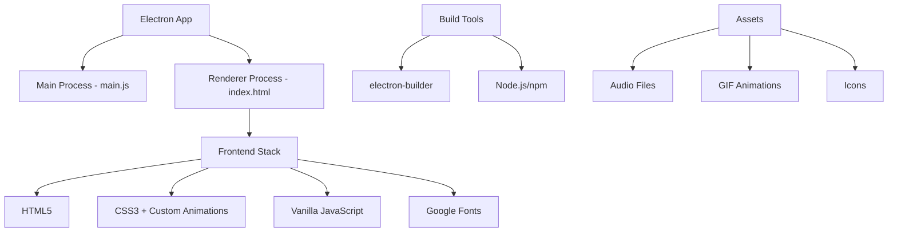

### Core Dependencies
- **Electron**: v37.2.6 (Desktop framework)
- **electron-builder**: v26.0.12 (Packaging and distribution)
- **Node.js**: Runtime environment

### Frontend Technologies
- **HTML5**: Application structure
- **CSS3**: Styling with CSS variables and animations
- **Vanilla JavaScript**: Application logic (703 lines)
- **Google Fonts**: Press Start 2P (retro gaming style), VT323 (monospace)

## Architecture

### Electron Architecture Pattern

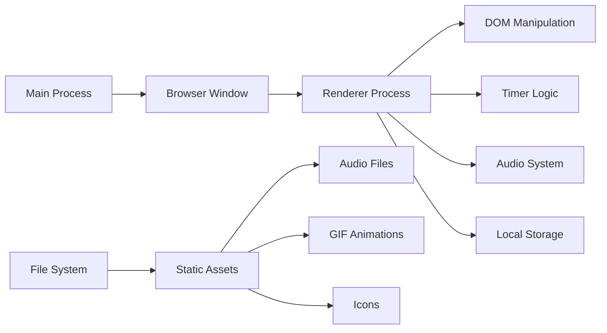

**Main Process (main.js)**:
- Creates browser window (1200x900px)
- Manages application lifecycle
- Handles window creation and destruction
- Enables Node.js integration in renderer

**Renderer Process (index.html + script.js)**:
- Manages UI and user interactions
- Implements timer logic and state management
- Handles audio playback and notifications
- Manages data persistence via localStorage

### Component Architecture

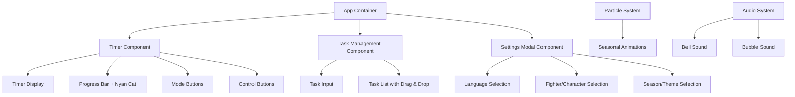

## Core Features & Business Logic

### 1. Timer System Architecture

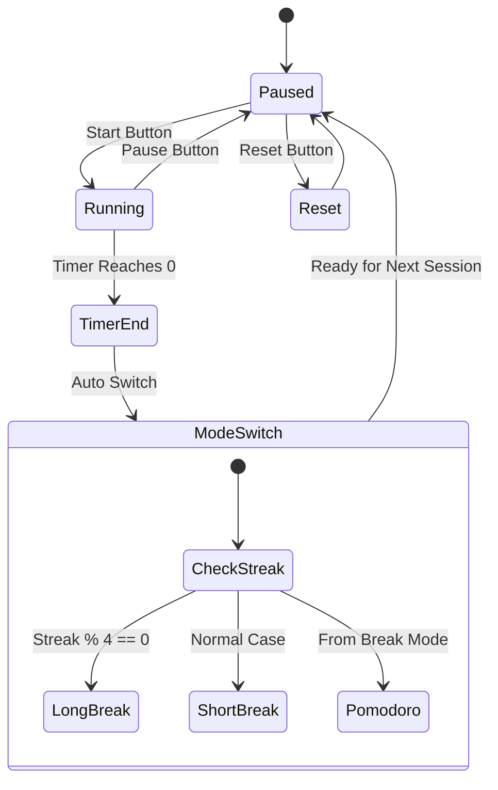

**Timer Modes**:
- **Pomodoro**: 25-minute work sessions (customizable)
- **Short Break**: 5-minute breaks (customizable)
- **Long Break**: 15-minute breaks after every 4 Pomodoros (customizable)

**State Management**:
- `totalSeconds`: Current timer countdown
- `isPaused`: Timer running state
- `mode`: Current timer mode
- `pomodoroStreak`: Consecutive Pomodoro count
- `initialModeDuration`: Reference for progress calculation

### 2. Progress Visualization System

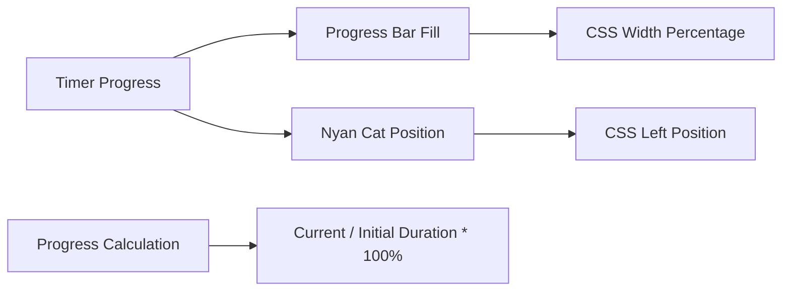

**Visual Elements**:
- Progress bar that fills as timer progresses
- Animated Nyan Cat character that moves across the progress bar
- 5 different Nyan Cat variations selectable by user

### 3. Task Management System

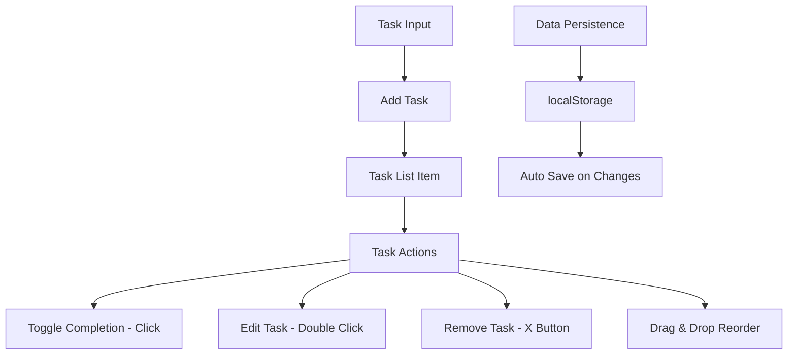

**Task Features**:
- Add new tasks with Enter key or button
- Mark tasks as complete/incomplete
- Edit tasks via double-click
- Drag and drop reordering
- Persistent storage across sessions

### 4. Daily Target Tracking

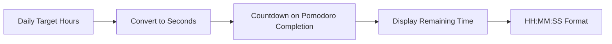

**Target System**:
- Set daily work hour goals
- Automatic countdown when Pomodoros complete
- Real-time remaining time display
- Persistent across application sessions

## Customization & Theming System

### 1. Multi-language Support

**Supported Languages**:
- English (en) - Default
- Spanish (es)
- Greek (el)
- Vietnamese (vi)

**Translation Architecture**:
```javascript
const translations = {
  [lang]: {
    // UI element translations
    // Notification messages
    // Mode labels
  }
}
```

### 2. Character Selection System

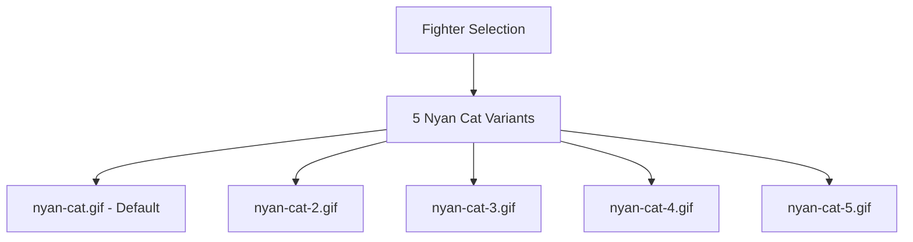

### 3. Seasonal Theme System

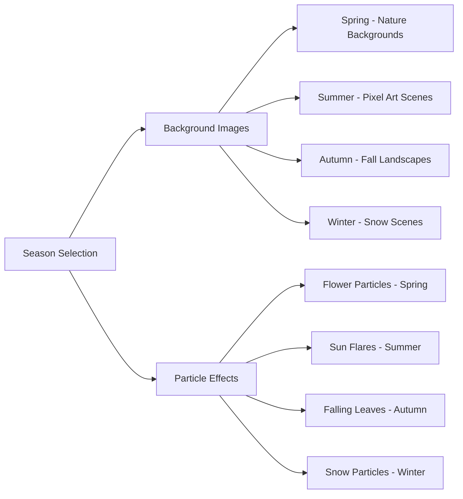

**Theme Implementation**:
- CSS class-based theme switching on body element
- External background images from various sources
- Procedurally generated particle effects (50+ particles per theme)
- Smooth transitions between themes

### 4. Particle Animation System

**Particle Types & Algorithms**:
```javascript
// Winter: 50 snow particles with 3 size variants
// Spring: 50 flower particles with star clip-path
// Summer: 10 sun flare particles with radial gradients
// Autumn: 40 leaf particles with 3 shapes × 2 colors
```

**Animation Properties**:
- Random horizontal positioning (0-100vw)
- Variable fall speeds (5-15 second durations)
- CSS keyframe animations for natural movement
- Infinite looping with linear timing

## Audio & Notification System

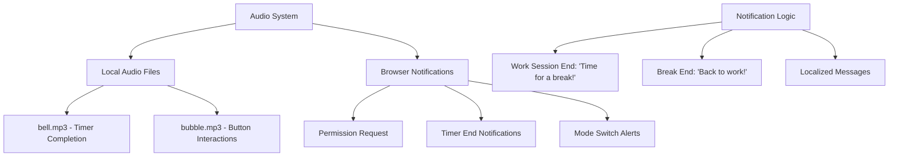

**Audio Features**:
- Immediate audio feedback on user actions
- Timer completion alerts
- Error handling for audio playback failures
- Volume control via browser settings

## Data Persistence Architecture

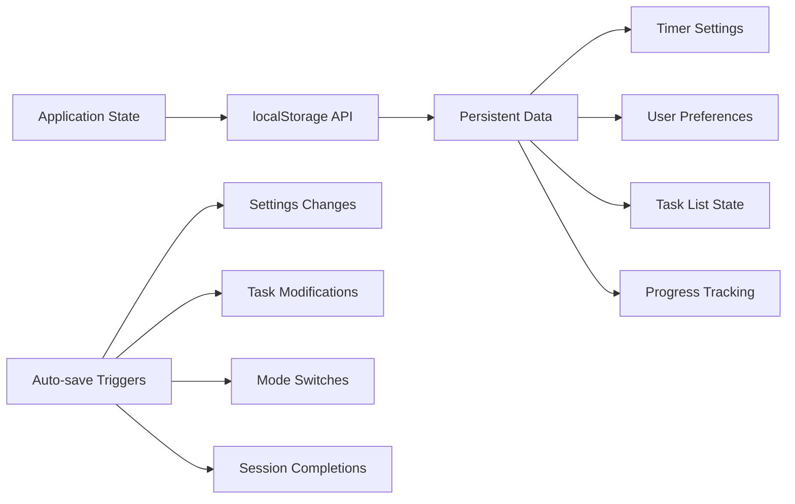

**Stored Data**:
- Timer duration preferences
- Language selection
- Character/fighter choice
- Season theme preference
- Task list with completion status
- Pomodoro streak count
- Daily target progress

## Build & Deployment Configuration

### Development Workflow
```bash
# Install dependencies
npm install

# Development mode
npm start

# Build distribution
npm run dist  # Requires admin privileges
```

### Build Configuration (package.json)
```json
{
  "build": {
    "files": [
      "index.html", "main.js", "script.js", "style.css",
      "bell.mp3", "bubble.mp3", 
      "nyan-cat*.gif", "icon.png"
    ],
    "win": {
      "target": "nsis",
      "icon": "icon.ico"
    },
    "linux": {
      "target": "AppImage", 
      "icon": "icon.png"
    }
  }
}
```

### Distribution Outputs
- **Windows**: NSIS installer (.exe) with custom installation directory
- **Linux**: AppImage portable executable
- **Asset bundling**: All static files packaged into executable

## File Structure & Module Organization

```
pomodoro-timer/
├── main.js                 # Electron main process
├── index.html             # Application entry point (96 lines)
├── script.js              # Core application logic (703 lines)
├── style.css              # Styling and animations (688 lines)
├── package.json           # Project configuration and build settings
├── README.txt             # Build instructions
├── Audio Assets/
│   ├── bell.mp3          # Timer completion sound
│   └── bubble.mp3        # UI interaction sound
├── Visual Assets/
│   ├── icon.ico          # Windows application icon
│   ├── icon.png          # Linux application icon
│   ├── nyan-cat.gif      # Default character animation
│   ├── nyan-cat-2.gif    # Character variant 2
│   ├── nyan-cat-3.gif    # Character variant 3
│   ├── nyan-cat-4.gif    # Character variant 4
│   └── nyan-cat-5.gif    # Character variant 5
└── Build Output/
    └── dist/             # Generated executables (Windows/Linux)
```

## Security & Performance Considerations

### Security Model
- **Node Integration Enabled**: Required for Electron functionality but increases attack surface
- **Context Isolation Disabled**: Legacy compatibility mode
- **Local-only Operation**: No external API calls or network dependencies
- **Admin Privileges**: Required only for build process (potential security concern)

### Performance Characteristics
- **Minimal Resource Usage**: Lightweight timer logic with 1-second intervals
- **Efficient Animations**: CSS-based animations with GPU acceleration
- **Asset Optimization**: Local assets bundled with application
- **Memory Management**: Automatic cleanup of completed timer intervals

### Known Limitations
- Requires admin privileges for executable generation
- External dependencies for background images (CDN links)
- No automatic update mechanism
- Limited to desktop platforms (Windows/Linux)

## Testing Strategy

**Current State**: No formal testing framework implemented

**Recommended Testing Approach**:
- **Unit Testing**: Timer logic, task management functions
- **Integration Testing**: Electron main/renderer process communication  
- **End-to-End Testing**: Complete user workflows with Spectron
- **Visual Regression Testing**: Theme and animation consistency
- **Audio Testing**: Cross-platform sound playback verification