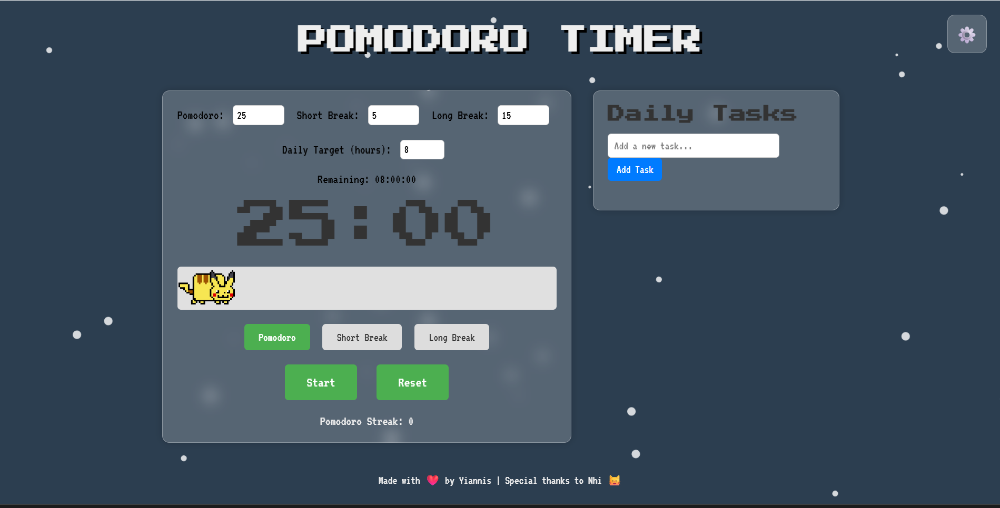

# Pomodoro Timer 🍅

A retro 8-bit styled desktop Pomodoro timer application built with Electron. This app helps you implement the Pomodoro Technique for improved focus and productivity through timed work and break sessions.

## 📸 Preview



*Experience the nostalgic 8-bit interface with Nyan Cat animations during breaks!*

## ✨ Features

- **Customizable Timer**: Set your preferred work and break durations
- **Audio Alerts**: Sound notifications (`bell.mp3`, `bubble.mp3`) at session transitions
- **Visual Animations**: Fun Nyan Cat GIF animations during break periods
- **Retro 8-bit Design**: Nostalgic pixel-art styling
- **Desktop Application**: Runs offline as a native desktop app
- **Cross-platform**: Built with Electron for Windows and Linux support

## 🚀 Quick Start

### For Users
1. Download the latest release from the [Releases](https://github.com/IoannisPontix/Pomodoro-Timer/releases) page
2. Run the installer (`Pomodoro Timer Setup x.x.x.exe`)
3. Choose your installation directory
4. Launch the application and start your Pomodoro sessions!

### For Developers

#### Prerequisites
- Node.js (v16 or higher recommended)
- npm or yarn
- **Administrator privileges** (required for building Windows executables)

#### Installation
```bash
# Clone the repository
git clone https://github.com/IoannisPontix/Pomodoro-Timer.git
cd Pomodoro-Timer

# Install dependencies
npm install
```

#### Development
```bash
# Start in development mode
npm start
```

## 🏗️ Building the Executable

### Important Notes Before Building:
1. **Run as Administrator**: Building the Windows executable requires administrator privileges
2. **Clean Build**: Ensure `dist/` directory is clean before building
3. **Dependencies**: Make sure all npm dependencies are installed

### Build Commands
```bash
# Build production executable (REQUIRES ADMIN PRIVILEGES)
npm run dist
```

### Build Output
- **Windows**: `dist/Pomodoro Timer Setup x.x.x.exe` (NSIS installer)
- **Linux**: `dist/pomodoro-timer-x.x.x.AppImage` (if building on Linux)

### Troubleshooting Build Issues
- **Permission Denied**: Ensure you're running the terminal as Administrator
- **Missing Dependencies**: Run `npm install` to reinstall dependencies
- **Antivirus Interference**: Temporarily disable antivirus during build process
- **Disk Space**: Ensure adequate disk space (builds can be ~200MB+)

## 📁 Project Structure

```
pomodoro-timer/
├── index.html          # Main UI interface
├── main.js             # Electron main process
├── script.js           # Timer logic and UI interactions
├── style.css           # 8-bit retro styling
├── package.json        # App configuration and build settings
├── .gitignore          # Git ignore rules (excludes node_modules, dist)
├── README.md           # This file
├── Assets/
│   ├── bell.mp3        # Work session end sound
│   ├── bubble.mp3      # Break session end sound
│   ├── nyan-cat*.gif   # Break period animations
│   ├── icon.png        # App icon (Linux)
│   └── icon.ico        # App icon (Windows)
└── dist/               # Build output (auto-generated, not tracked in Git)
```

## 🔧 Development Workflow

### Making Changes
1. Edit source files (`index.html`, `script.js`, `style.css`, `main.js`)
2. Test changes with `npm start`
3. Commit changes to Git
4. Build new executable with `npm run dist` (as Administrator)

### Version Management
1. Update version in `package.json`
2. Commit version changes
3. Create Git tag: `git tag v1.0.x`
4. Push tags: `git push --tags`
5. Build and release new executable

### Git Best Practices
- **Never commit** `node_modules/` or `dist/` directories
- Use `.gitignore` to exclude build artifacts
- Keep repository lightweight for easier collaboration

## 🛠️ Technology Stack

- **Frontend**: HTML5, CSS3, Vanilla JavaScript
- **Desktop Framework**: Electron v37.2.6
- **Build Tool**: electron-builder v26.0.12
- **Package Manager**: npm
- **Installer**: NSIS (Windows)

## 📝 Configuration

Key configuration in `package.json`:
- **App ID**: `com.example.pomodorotimer`
- **Product Name**: "Pomodoro Timer"
- **Build Targets**: Windows NSIS, Linux AppImage
- **Included Files**: Source files and assets (excluding node_modules)

## 🐛 Known Issues & Limitations

- Building requires Administrator privileges on Windows
- No auto-update mechanism implemented
- Linux builds not actively tested
- No session statistics or history tracking

## 🤝 Contributing

1. Fork the repository
2. Create a feature branch: `git checkout -b feature/amazing-feature`
3. Commit your changes: `git commit -m 'Add amazing feature'`
4. Push to the branch: `git push origin feature/amazing-feature`
5. Open a Pull Request

## 📄 License

This project is licensed under the ISC License.

## 👨‍💻 Author

**Ioannis** - [IoannisPontix](https://github.com/IoannisPontix)

---

## 🚨 Important Reminders for Future Development

### Before Building EXE:
1. ✅ **Run terminal as Administrator**
2. ✅ **Update version in package.json if needed**
3. ✅ **Ensure all changes are committed to Git**
4. ✅ **Clean previous build: delete `dist/` folder**
5. ✅ **Run `npm install` to ensure dependencies are current**
6. ✅ **Execute `npm run dist`**
7. ✅ **Test the generated installer before release**

### Git Repository Management:
- ✅ **Never commit `node_modules/` or `dist/` folders**
- ✅ **Use `.gitignore` to exclude large files**
- ✅ **Keep repository under GitHub's file size limits**
- ✅ **Run `npm install` after cloning to restore dependencies**

*Happy Pomodoro-ing! 🍅✨*